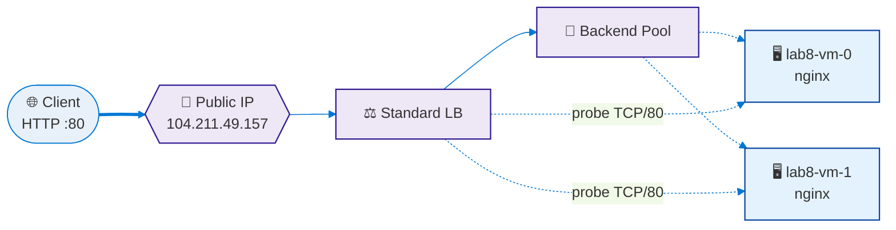

<div align="center">

# 🛰️ Lab #8 — Infrastructure as Code with **Terraform** on **Azure**

### *Public Load Balancer · 2× Linux VMs · Remote State · GitHub Actions OIDC*

[](https://www.terraform.io/)
[](https://azure.microsoft.com/)
[](https://registry.terraform.io/providers/hashicorp/azurerm/latest)
[](https://ubuntu.com/)
[](https://nginx.org/)
[](.github/workflows/terraform.yml)
[](https://github.com/TerraFour-ECI/arsw-terraform-azure-load-balancing)

**Course:** BluePrints / ARSW · **Institution:** Escuela Colombiana de Ingeniería Julio Garavito  
**Repository:** [`arsw-terraform-azure-load-balancing`](https://github.com/TerraFour-ECI/arsw-terraform-azure-load-balancing)

</div>

---

## 👥 Team

| Avatar | Member | GitHub |
| :---: | :--- | :--- |
|  | **Andersson David Sánchez Méndez** | [@AnderssonProgramming](https://github.com/AnderssonProgramming) |
|  | **Cristian Santiago Pedraza Rodríguez** | [@cris-eci](https://github.com/cris-eci) |
|  | **Elizabeth Correa Suárez** | [@Eliza-05](https://github.com/Eliza-05) |
|  | **Juan Sebastian Ortega Muñoz** | [@Juanseom](https://github.com/Juanseom) |

---

## 🎯 Purpose

Modernise the classic Azure load-balancing lab by using **Terraform** to
define, provision and version every piece of the infrastructure. The goal
is to produce a **reproducible, secure and well-documented** deployment
that follows IaC best practices end-to-end.

### 🧠 Learning objectives

1. 🧩 Model Azure infrastructure with Terraform (providers, state, modules, variables).
2. 🚦 Deploy a **highly available** workload behind an **Azure Load Balancer (L4)** with 2+ Linux VMs.
3. 🛡️ Apply minimum security hardening: **NSG**, **SSH key auth**, **tags**, naming conventions.
4. 🗄️ Use a **remote state backend** in Azure Storage with **state locking**.
5. ⚙️ Automate `plan`/`apply` from **GitHub Actions** with **OIDC** authentication (no long-lived secrets).
6. 💸 Validate operation (health probe, demo page), observe costs and **destroy safely**.

> 🟦 This lab replaces the click-ops version. Focus stays on **IaC** and **pipelines**.

---

## 🏗️ Target architecture

> 📐 Full **Mermaid** component & sequence diagrams live in
> [docs/DIAGRAMS.md](docs/DIAGRAMS.md). Quick overview:



| Layer        | Resource                                                                   |
| :----------- | :------------------------------------------------------------------------- |
| 🧱 Container | `azurerm_resource_group.lab8-rg`                                           |
| 🌐 Network   | `lab8-vnet` (10.10.0.0/16) · `subnet-web` (10.10.1.0/24) · `subnet-mgmt`   |
| 🖥️ Compute   | 2 × Ubuntu 22.04 `Standard_B1s`, nginx via cloud-init                      |
| 🚦 Edge      | Standard LB · static Public IP · TCP/80 probe · 80→80 rule                 |
| 🛡️ Security  | NSG: 80/TCP from `*` · 22/TCP only from operator `/32`                     |
| 🗄️ State     | `sttfstate658` storage account → `tfstate` container → blob lease lock     |
| 🔐 CI auth   | OIDC federation: GitHub Actions ↔ Azure AD service principal               |

---

## 📁 Repository layout

```text
.
├─ infra/                        # Root Terraform composition
│  ├─ main.tf                    # Wires modules together (+ optional challenges)
│  ├─ providers.tf               # azurerm + remote backend declaration
│  ├─ variables.tf               # Typed root inputs (validated)
│  ├─ outputs.tf                 # lb_public_ip, vm_names, rg name (+ challenge outputs)
│  ├─ cloud-init.yaml            # nginx bootstrap with hostname banner
│  ├─ backend.hcl.example        # Template for remote state config
│  └─ env/
│     ├─ dev.tfvars                       # Base lab values
│     └─ dev-challenges.tfvars.example    # Overlay enabling Bastion + Budget
├─ modules/
│  ├─ vnet/                      # VNet + subnets (+ optional AzureBastionSubnet)
│  ├─ compute/                   # NICs + Linux VMs (cloud-init)
│  ├─ lb/                        # Public LB + NSG
│  ├─ bastion/                   # 🎁 Optional: Azure Bastion (no public SSH)
│  └─ budget/                    # 🎁 Optional: Cost Management budget + alerts
├─ .github/
│  ├─ CODEOWNERS                 # Required reviewers per path
│  └─ workflows/
│     └─ terraform.yml           # CI/CD: lint → plan → apply / destroy
├─ docs/
│  ├─ DIAGRAMS.md                # Mermaid component + sequence diagrams
│  ├─ REFLECTION.md              # 1-page technical reflection
│  ├─ OIDC_SETUP.md              # Step-by-step Azure ↔ GitHub OIDC guide
│  ├─ CHALLENGES.md              # 🎁 How to enable Bastion + Budget challenges
│  └─ INSTALL_TERRAFORM.md       # Terraform install / quick start
└─ report/
   ├─ main.tex                   # LaTeX report (Lab #8)
   ├─ main.pdf                   # Compiled report (7 pages, embedded diagrams)
   └─ media/                     # Report assets (diagrams, logos)
```

---

## ✅ Requirements

* ☁️ **Azure subscription** (Azure for Students works fine).
* 🛠️ **Azure CLI** (`az`) and **Terraform ≥ 1.6** installed locally — see
  [docs/INSTALL_TERRAFORM.md](docs/INSTALL_TERRAFORM.md).
* 🔑 **SSH key** generated locally (`ssh-keygen -t ed25519`).
* 🐙 **GitHub repo** with permission to create environments and secrets.

---

## 🚀 Bootstrap the remote backend (once per team)

```bash
# Run these once — they persist across every apply / destroy.
SUFFIX=$RANDOM
LOCATION=eastus
RG=rg-tfstate-lab8
STO=sttfstate${SUFFIX}
CONTAINER=tfstate

az group create -n $RG -l $LOCATION
az storage account create -g $RG -n $STO -l $LOCATION \
   --sku Standard_LRS --encryption-services blob
az storage container create --name $CONTAINER --account-name $STO
```

Copy `infra/backend.hcl.example` to `infra/backend.hcl` and fill in the
storage account name. `backend.hcl` is git-ignored on purpose — never
commit it.

---

## 💻 Local workflow (PowerShell-friendly)

```powershell
# 1. Authenticate to Azure
az login
az account show

# 2. Generate an SSH key if you don't have one yet
ssh-keygen -t ed25519 -f "$env:USERPROFILE\.ssh\id_ed25519" -N '""' -C "lab8-arsw"

# 3. Adjust env/dev.tfvars with YOUR values
#    - ssh_public_key      -> path to YOUR id_ed25519.pub
#    - allow_ssh_from_cidr -> YOUR public IP (https://api.ipify.org) + /32

# 4. Initialise (remote backend)
cd infra
terraform init "-backend-config=backend.hcl"

# 5. Static checks + plan
terraform fmt -recursive
terraform validate
terraform plan "-var-file=env/dev.tfvars" -out plan.tfplan

# 6. Apply and curl the LB
terraform apply "plan.tfplan"
curl "http://$(terraform output -raw lb_public_ip)"

# 7. Destroy when you are done
terraform destroy "-var-file=env/dev.tfvars" -auto-approve
```

> 💡 **PowerShell quoting:** flags that contain `=` must be quoted, e.g.
> `"-backend-config=backend.hcl"` and `"-var-file=env/dev.tfvars"`.

---

## ⚙️ CI/CD — GitHub Actions with OIDC

The workflow [.github/workflows/terraform.yml](.github/workflows/terraform.yml)
runs:

* 🧹 **fmt + validate** on every PR / dispatch.
* 🔍 **plan** on every PR; the diff is posted as a sticky comment.
* 🚀 **apply / destroy** on `workflow_dispatch`, gated by the
  `production` environment (manual reviewer required).

Authentication uses **OpenID Connect** federation between GitHub and
Azure AD — no client secret stored in GitHub. The full setup is
documented in [docs/OIDC_SETUP.md](docs/OIDC_SETUP.md).

| Required GitHub secret  | Example value                                  |
| :---------------------- | :--------------------------------------------- |
| `AZURE_CLIENT_ID`       | App registration `appId` (federated)           |
| `AZURE_TENANT_ID`       | `az account show --query tenantId -o tsv`      |
| `AZURE_SUBSCRIPTION_ID` | `cd4ddc1a-042b-4bc4-b751-024854e4f459`         |
| `BACKEND_RG`            | `rg-tfstate-lab8`                              |
| `BACKEND_SA`            | `sttfstate658`                                 |
| `BACKEND_CONTAINER`     | `tfstate`                                      |
| `BACKEND_KEY`           | `lab8/terraform.tfstate`                       |

---

## 📊 Outputs from the recorded run

| Output                | Value                              |
| :-------------------- | :--------------------------------- |
| `lb_public_ip`        | **`104.211.49.157`**               |
| `resource_group_name` | `lab8-rg`                          |
| `vm_names`            | `["lab8-vm-0", "lab8-vm-1"]`       |

### 🔁 Round-robin evidence (`curl` against the LB)

```text
$ for ($i=0; $i -lt 6; $i++) { curl http://104.211.49.157 }
<h1>Hello from lab8-vm-0</h1>
<h1>Hello from lab8-vm-1</h1>
<h1>Hello from lab8-vm-0</h1>
<h1>Hello from lab8-vm-1</h1>
<h1>Hello from lab8-vm-0</h1>
<h1>Hello from lab8-vm-1</h1>
```

> Successive requests rotate through both backends — the Standard LB
> hashes the 5-tuple and the source port changes per connection.

---

## 🎬 Demo video

> 📹 The full apply → curl → destroy walkthrough is recorded here:
> **<https://drive.google.com/file/d/1CAY1gmPZbe96VobD-xGRg0q5HYMfCjOu/view>**

Highlights captured in the recording:

* ✅ `terraform init` against the remote backend.
* ✅ `terraform apply` provisioning the entire stack from scratch.
* ✅ `curl` rotating between `lab8-vm-0` and `lab8-vm-1`.
* ✅ `terraform destroy` cleanly tearing everything down.

---

## 💸 Cost estimate (East US, list price)

| Resource                       | Hourly       | Daily      |
| :----------------------------- | :----------: | :--------: |
| 2 × VM `Standard_B1s`          | ~USD 0.0104  | ~USD 0.50  |
| Standard Load Balancer         | ~USD 0.025   | ~USD 0.60  |
| Standard Public IP (static)    | ~USD 0.005   | ~USD 0.12  |
| Storage Account (state, LRS)   | ~USD 0.0002  | ~USD 0.005 |
| **Total**                      | **~USD 0.041** | **~USD 1.23** |

> 💡 An 8-hour development session costs ~**USD 0.33** — well within the
> Azure for Students credit. **Always run `destroy` at the end.**

---

## 📚 Deliverables checklist

* [x] 🧩 Modular Terraform code (`vnet`, `compute`, `lb`).
* [x] 🗄️ Remote state on Azure Storage with locking.
* [x] 🛡️ NSG hardened (HTTP from any, SSH from operator `/32`).
* [x] 🚦 Public LB with TCP/80 probe + HTTP rule.
* [x] ⚙️ GitHub Actions workflow with OIDC (plan on PR, manual apply/destroy).
* [x] 📐 Component & sequence diagrams ([docs/DIAGRAMS.md](docs/DIAGRAMS.md)).
* [x] 🧠 Technical reflection ([docs/REFLECTION.md](docs/REFLECTION.md)).
* [x] 📄 LaTeX report ([report/main.tex](report/main.tex)).
* [x] 🎬 Demo video (link above).
* [x] 🧹 `terraform destroy` executed at the end.

### 🎁 Optional challenges (*Retos*) — implemented

* [x] 🪜 **Azure Bastion** in `subnet-mgmt` area — opt-in via `enable_bastion = true`. See [docs/CHALLENGES.md](docs/CHALLENGES.md).
* [x] 💰 **Budget alert** with email notifications at 50/90/100% — opt-in via `enable_budget = true`. See [docs/CHALLENGES.md](docs/CHALLENGES.md).

---

## 🧠 Reflection (TL;DR — full version in [docs/REFLECTION.md](docs/REFLECTION.md))

* **Why L4 LB and not Application Gateway (L7)?** The lab serves plain
  HTTP traffic to identical backends — no TLS termination, no path-based
  routing, no WAF. L4 is cheaper, faster and 1:1 with IaC primitives.
  We left an upgrade path open by isolating the `lb` module.
* **Exposing 22/TCP** is a brute-force magnet; we mitigated by allowing
  only the operator `/32` in the NSG and by enforcing key-only auth on
  the VMs. Production should remove the public 22/TCP altogether and use
  **Azure Bastion** in `subnet-mgmt`.
* **Production upgrade levers**: VM Scale Set + autoscale, Availability
  Zones, Azure Bastion, Azure Monitor health alerts, budget alerts,
  module versioning in a private registry.

---

## 🧹 Cleanup

```powershell
cd infra
terraform destroy "-var-file=env/dev.tfvars" -auto-approve
```

The destroy is also exposed as `workflow_dispatch` with `action=destroy`
in the CI workflow — useful when nobody on the team has local Azure CLI
access.

---

## 📖 References

* 📘 [Azure Provider Docs](https://registry.terraform.io/providers/hashicorp/azurerm/latest/docs)
* 📗 [Terraform CLI Installation Guide](https://developer.hashicorp.com/terraform/tutorials/aws-get-started/install-cli)
* 📙 [Azure Load Balancer Overview](https://learn.microsoft.com/en-us/azure/load-balancer/load-balancer-overview)
* 📕 [GitHub Actions ↔ Azure OIDC](https://learn.microsoft.com/en-us/azure/developer/github/connect-from-azure-openid-connect)
* 📒 [Cloud-init Documentation](https://cloudinit.readthedocs.io/en/latest/)

---

<div align="center">

🛰️ **Lab #8 — ARSW · Escuela Colombiana de Ingeniería Julio Garavito** · 2026  
Made with 💙 by the team listed above.

</div>
