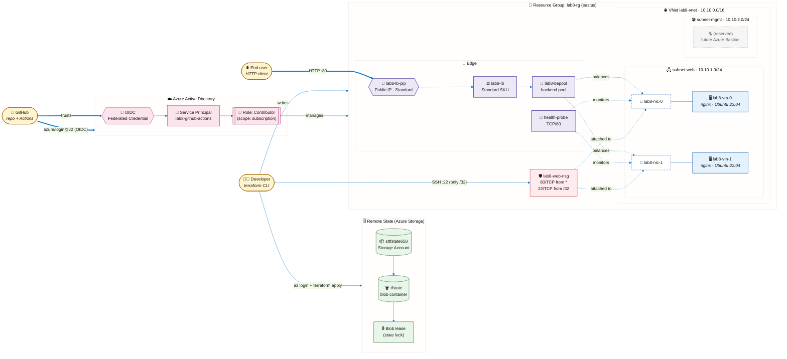
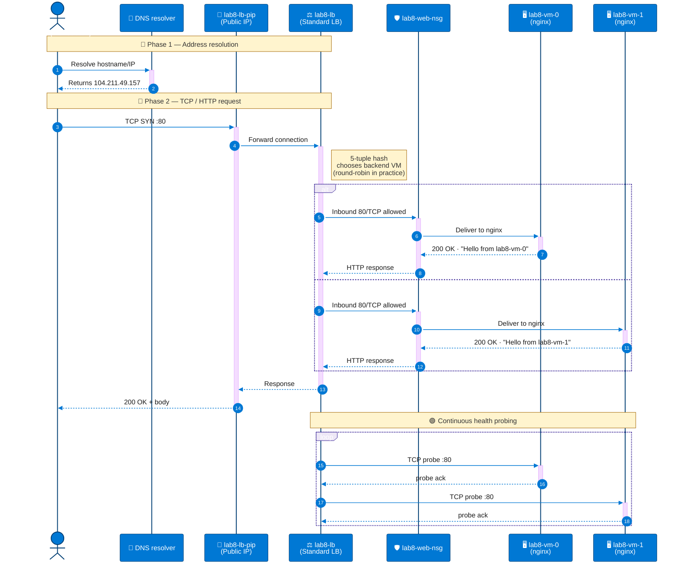
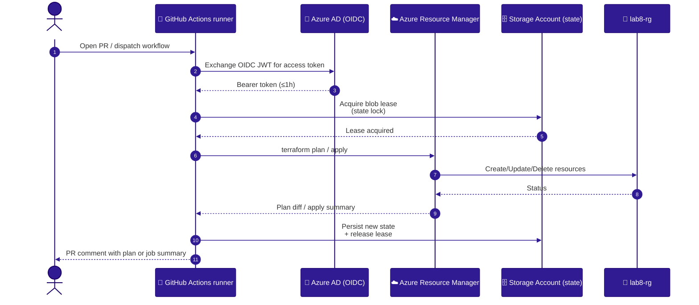

# Architecture Diagrams — Lab #8

> All diagrams are written in **Mermaid** (advanced syntax with classes,
> subgraphs and notes) so they render natively on GitHub and in any modern
> markdown viewer without extra tooling.

---

## 1. Component Diagram

The component diagram shows the **infrastructure layout deployed by
Terraform** in Azure: developer toolchain, CI/CD federation with Azure AD,
remote state storage and the actual workload (VNet + Load Balancer + VMs +
NSG).

### Component legend

| Color | Layer                 | Notes                                                    |
| :---- | :-------------------- | :------------------------------------------------------- |
| 🟦    | Compute (VMs / NICs)  | 2 × `Standard_B1s` Ubuntu, bootstrapped by cloud-init.   |
| 🟪    | Edge (LB / PIP)       | Standard SKU, single Public frontend, HTTP rule 80→80.   |
| 🟥    | NSG                   | Allow 80/TCP from any, 22/TCP from operator /32 only.    |
| 🟩    | Remote state          | Azure Storage Account + container + blob lease lock.     |
| 🟨    | Actors                | Developer CLI, end user and GitHub Actions runner.       |
| 🟫    | Identity              | OIDC federation between GitHub and Azure AD.             |

---

## 2. Sequence Diagram — End-user HTTP request

This sequence shows what happens when a client visits
`http://<lb_public_ip>` and the LB round-robins between the two backend
VMs.

### Notes on the sequence

* **Step 3-4 (TCP SYN)** is what the Standard LB intercepts on the
  configured frontend port. The probe state determines which backend
  pool members are eligible.
* **Round-robin behaviour**: Azure LB uses a *5-tuple hash*
  `(src IP, src port, dst IP, dst port, protocol)`; for `curl` runs from
  the same machine, the source port changes between connections, which is
  why successive requests rotate through both VMs.
* **NSG enforcement** happens *after* the LB chose a backend — the same
  NSG is bound to every NIC, so flows mirror the backend pool exactly.
* **Health probe loop** runs independently of user traffic; if a VM stops
  responding to the probe it is taken out of the pool transparently.

---

## 3. Sequence Diagram — CI/CD with OIDC

This second sequence highlights how no long-lived secret is stored: the
GitHub job mints a short-lived OIDC JWT, swaps it for an Azure AD access
token, and uses it to talk to ARM and to the state Storage Account.

---

## How to render

* **GitHub** renders Mermaid blocks natively — just open this file on the
  web UI.
* **VS Code**: install the *Markdown Preview Mermaid Support* extension.
* **Standalone export**: paste any block into <https://mermaid.live> and
  export PNG/SVG.
